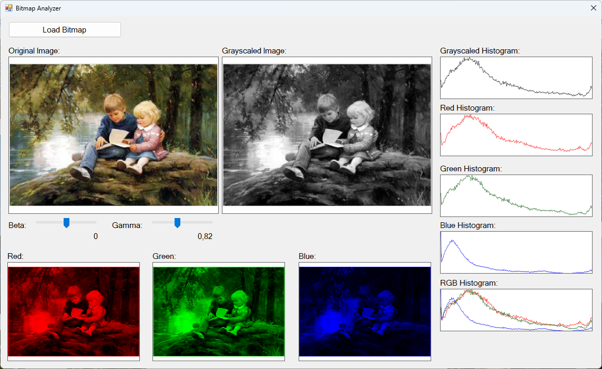

# C# Bitmap Analyzer
This project is a simple image processing example application with C#.

Shows original and grayscaled images and color channels. Sliders apply beta / gamma correction. 

# License
The Unlicense. Feel free to use or change it how you need.
